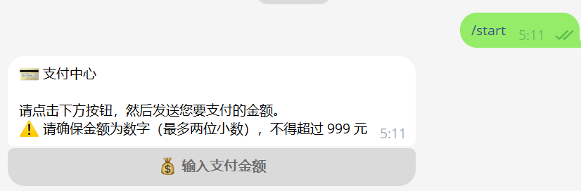
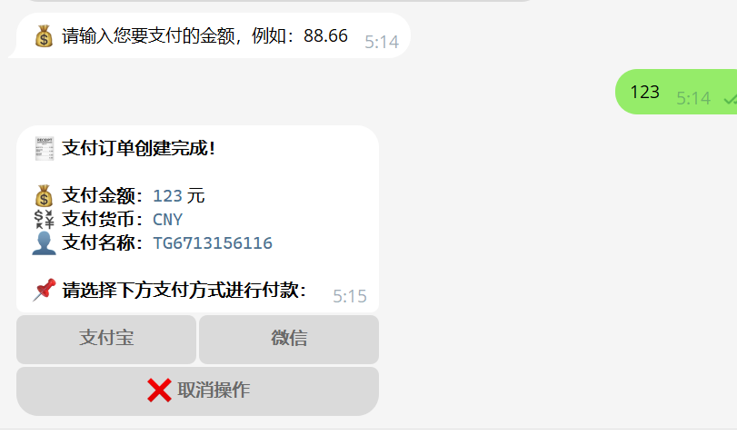
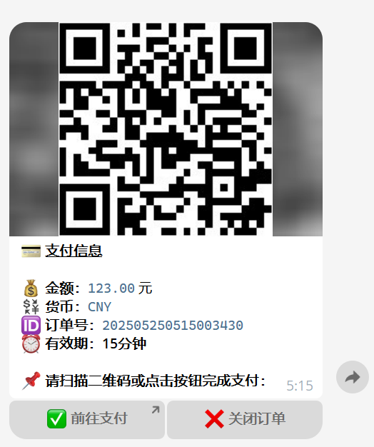

# 💳 TG支付机器人

[](LICENSE)
[](https://www.php.net/)
[](https://www.mysql.com/)
[](https://core.telegram.org/bots/api)

TG支付机器人是一套基于 **PHP + MySQL + Telegram Bot API** 的轻量级个人支付解决方案，支持 **易支付接口**，实现 **微信 / 支付宝收款**，并配套 **可视化后台管理系统**，提供订单管理与配置操作。  

---

## 📑 目录

- [🚀 功能亮点](#-功能亮点)
- [📱 使用流程演示](#-使用流程演示)
- [🔐 管理后台](#-管理后台)
- [⚙️ 安装与部署](#️-安装与部署)
- [🔗 第三方依赖](#-第三方依赖)
- [⚠️ 注意事项](#️-注意事项)
- [📄 开源协议](#-开源协议)

---

## 🚀 功能亮点

### 🤖 Telegram 机器人核心功能
- **支付引导**  
  - `/start`：展示支付说明和按钮，引导用户进入支付流程  
  - `/pay 金额`：一键生成订单并返回二维码 / 支付链接  
  - `/login`：仅限管理员，生成一次性后台登录入口  

- **智能支付流程**  
  - 输入金额 → 选择支付方式（支付宝 / 微信） → 自动生成订单二维码或跳转链接  

### 🔗 易支付接口对接
- 支持 **支付宝 / 微信收款**  
- **MD5 签名校验**，安全可靠  
- 自动生成 **支付二维码 / 跳转链接**  

### 🖼️ 二维码展示
- 默认调用 `qrserver` API 生成二维码  
- 可替换为本地服务以提升性能和稳定性  

### 📊 网页后台管理
- **订单管理**：订单查询、状态跟踪  
- **配置中心**：易支付商户参数配置（商户ID、密钥、回调地址）  
- **系统管理**：站点配置、管理员权限控制  
- **界面技术**：基于 **Layui**，清爽简洁，操作直观  

---

## 📱 使用流程演示

1. **启动支付流程**  
   用户发送 `/start` → 机器人返回支付引导按钮  

   

2. **输入金额生成订单**  
   用户输入金额 → 机器人生成订单 → 提示选择支付方式  

   

3. **扫码支付**  
   用户选择支付方式 → 返回二维码 / 跳转按钮 → 完成支付  

   

---

## 🔐 管理后台

- **管理员命令**：发送 `/login` 获取一次性后台登录入口  
- **后台功能**：  
  - 订单记录查询与导出  
  - 易支付接口参数配置（商户ID、密钥、通知地址）  
  - 系统参数管理（站点、缓存、权限）  

---

## ⚙️ 安装与部署

1. **环境要求**  
   - PHP 7.2+（推荐 7.4+）  
   - MySQL 5.7+  
   - Redis（可选，用于缓存）  
   - Nginx 或 Apache  

2. **上传代码**  
   - 将完整项目上传至服务器网站目录  

3. **初始化配置**  
   - 访问 `config_install.php`  
   - 填写数据库、Redis、TG Token、管理员ID、站点域名  
   - 自动生成配置文件 & 初始化数据库  

4. **配置易支付**  
   - 登录后台 → 进入 `admin/easypay_config.php` → 设置商户参数  

5. **启动机器人**  
   推荐使用宝塔面板 `supervisord` 后台运行：  

   ```bash
   /www/server/php/74/bin/php /www/wwwroot/项目路径/bot.php
   ```

---

## 🔗 第三方依赖

- [Telegram Bot API](https://core.telegram.org/bots/api)  
- [Layui](https://www.layui.com/)  
- 易支付接口（需参考服务商文档配置）  
- 二维码服务：[QRServer](https://api.qrserver.com/v1/create-qr-code/)  

---

## ⚠️ 注意事项

- 请确保易支付接口配置（商户ID、密钥）与平台后台一致  
- Telegram Bot 需在 **私聊** 或 **有管理权限的群组**中使用  
- 大并发场景建议部署本地二维码生成服务替代第三方API  

---

## 📄 开源协议

本项目基于 **MIT License** 开源，允许自由修改、二次开发，详见 [LICENSE](LICENSE)。  

---

✨ 欢迎提交 Issue 或 Pull Request，感谢使用与支持！
